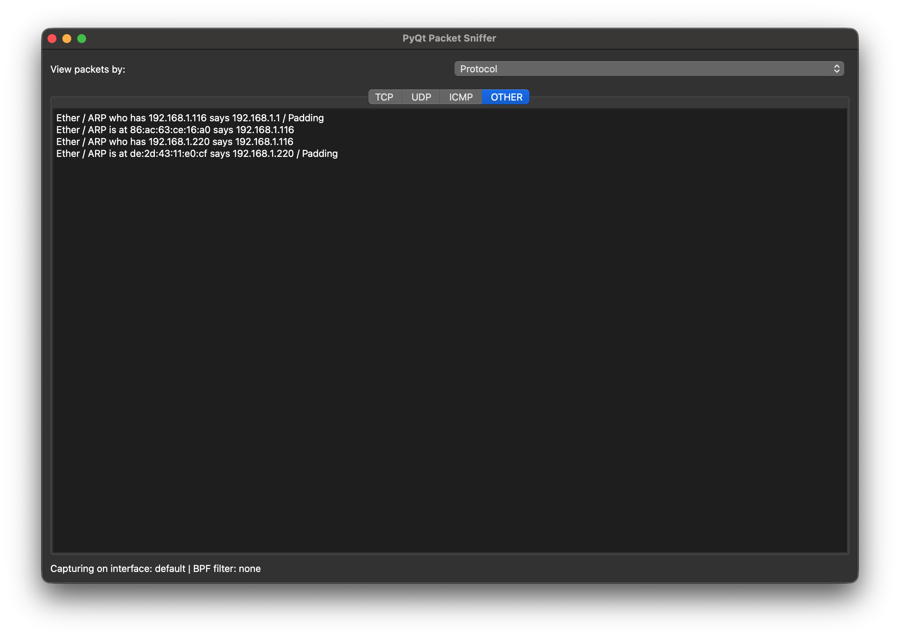
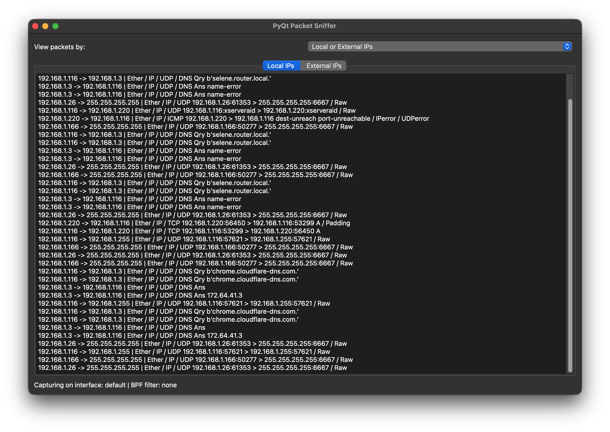
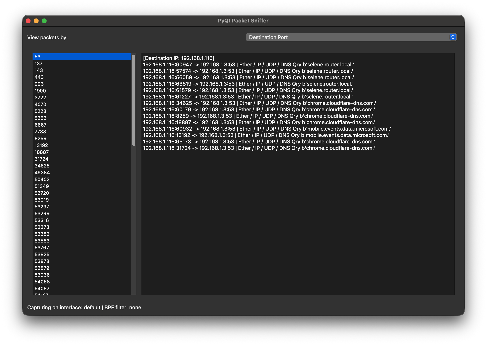

# Лабораторна робота №4

## Про програму

Ця програма є мережевим сніфером на Python із графічним інтерфейсом PyQt5. Вона перехоплює пакети в реальному часі та показує основну інформацію про них.
Вона дозволяє аналізувати трафік за протоколом, локальними або зовнішніми IP-адресами, а також за портами джерела і призначення.

## Код програми

Також доступний у [цьому репозиторії](https://github.com/nshkkz/python_network_sniffer/tree/lab4).

```py
import argparse
import ipaddress
import sys
import threading

from PyQt5.QtCore import QThread, Qt, pyqtSignal
from PyQt5.QtWidgets import (
    QApplication,
    QComboBox,
    QHBoxLayout,
    QLabel,
    QListWidget,
    QListWidgetItem,
    QMainWindow,
    QMessageBox,
    QStackedWidget,
    QTabWidget,
    QTextEdit,
    QVBoxLayout,
    QWidget,
)
from scapy.all import ICMP, IP, TCP, UDP, get_if_addr, sniff


class PortListItem(QListWidgetItem):
    def __init__(self, port_text):
        super().__init__(port_text)
        self.port_value = int(port_text)

    def __lt__(self, other):
        if isinstance(other, PortListItem):
            return self.port_value < other.port_value
        return super().__lt__(other)


class SnifferThread(QThread):
    packet_captured = pyqtSignal(dict)
    sniffer_error = pyqtSignal(str)

    def __init__(self, interface=None, bpf_filter=""):
        super().__init__()
        self.interface = interface
        self.bpf_filter = bpf_filter
        self.stop_event = threading.Event()

    def _packet_callback(self, packet):
        src_ip = packet[IP].src if IP in packet else None
        dst_ip = packet[IP].dst if IP in packet else None
        src_port = packet.sport if hasattr(packet, "sport") else None
        dst_port = packet.dport if hasattr(packet, "dport") else None

        if TCP in packet:
            protocol = "TCP"
        elif UDP in packet:
            protocol = "UDP"
        elif ICMP in packet:
            protocol = "ICMP"
        else:
            protocol = "OTHER"

        self.packet_captured.emit(
            {
                "summary": packet.summary(),
                "src_ip": src_ip,
                "dst_ip": dst_ip,
                "src_port": src_port,
                "dst_port": dst_port,
                "protocol": protocol,
            }
        )

    def run(self):
        try:
            while not self.stop_event.is_set():
                sniff(
                    iface=self.interface,
                    filter=self.bpf_filter,
                    prn=self._packet_callback,
                    store=0,
                    timeout=1,
                )
        except Exception as exc:
            self.sniffer_error.emit(str(exc))

    def stop(self):
        self.stop_event.set()


class SnifferWindow(QMainWindow):
    def __init__(self, interface=None, bpf_filter=""):
        super().__init__()
        self.interface = interface
        self.bpf_filter = bpf_filter
        self.local_ips = self._build_local_ip_set(interface)

        self.protocol_outputs = {}
        self.ip_scope_outputs = {}
        self.src_port_outputs = {}
        self.dst_port_outputs = {}

        self.src_port_list = None
        self.dst_port_list = None
        self.src_port_viewer = None
        self.dst_port_viewer = None
        self.protocol_tabs = None
        self.ip_scope_tabs = None

        self.sniffer_thread = SnifferThread(interface=interface, bpf_filter=bpf_filter)
        self.sniffer_thread.packet_captured.connect(self.handle_packet)
        self.sniffer_thread.sniffer_error.connect(self.handle_sniffer_error)

        self._build_ui()
        self.sniffer_thread.start()

    def _build_local_ip_set(self, interface):
        local_ips = {"127.0.0.1"}
        if interface:
            try:
                local_ips.add(get_if_addr(interface))
            except Exception:
                pass
        return local_ips

    def _build_ui(self):
        self.setWindowTitle("PyQt Packet Sniffer")
        self.resize(1100, 720)

        root = QWidget()
        root_layout = QVBoxLayout(root)

        selector_layout = QHBoxLayout()
        selector_label = QLabel("View packets by:")
        self.filter_selector = QComboBox()
        self.filter_selector.addItems(
            [
                "Protocol",
                "Local or External IPs",
                "Source Port",
                "Destination Port",
            ]
        )
        self.filter_selector.currentIndexChanged.connect(self.on_filter_mode_changed)

        selector_layout.addWidget(selector_label)
        selector_layout.addWidget(self.filter_selector)

        self.stack = QStackedWidget()
        self.stack.addWidget(self._build_protocol_page())
        self.stack.addWidget(self._build_ip_scope_page())
        self.stack.addWidget(self._build_source_port_page())
        self.stack.addWidget(self._build_destination_port_page())

        self.status_label = QLabel(
            f"Capturing on interface: {self.interface or 'default'} | BPF filter: {self.bpf_filter or 'none'}"
        )

        root_layout.addLayout(selector_layout)
        root_layout.addWidget(self.stack)
        root_layout.addWidget(self.status_label)

        self.setCentralWidget(root)

    def _build_protocol_page(self):
        tabs = QTabWidget()
        tabs.currentChanged.connect(self._on_protocol_tab_changed)
        for protocol in ["TCP", "UDP", "ICMP", "OTHER"]:
            output = QTextEdit()
            output.setReadOnly(True)
            tabs.addTab(output, protocol)
            self.protocol_outputs[protocol] = output
        self.protocol_tabs = tabs
        return tabs

    def _build_ip_scope_page(self):
        tabs = QTabWidget()
        tabs.currentChanged.connect(self._on_ip_scope_tab_changed)
        for scope in ["Local IPs", "External IPs"]:
            output = QTextEdit()
            output.setReadOnly(True)
            tabs.addTab(output, scope)
            self.ip_scope_outputs[scope] = output
        self.ip_scope_tabs = tabs
        return tabs

    def _build_source_port_page(self):
        page = QWidget()
        layout = QHBoxLayout(page)

        self.src_port_list = QListWidget()
        self.src_port_viewer = QTextEdit()
        self.src_port_viewer.setReadOnly(True)
        self.src_port_list.currentTextChanged.connect(
            lambda text: self._show_port_messages(
                text=text,
                storage=self.src_port_outputs,
                viewer=self.src_port_viewer,
                prefix="Source",
            )
        )

        layout.addWidget(self.src_port_list, 1)
        layout.addWidget(self.src_port_viewer, 3)
        return page

    def _build_destination_port_page(self):
        page = QWidget()
        layout = QHBoxLayout(page)

        self.dst_port_list = QListWidget()
        self.dst_port_viewer = QTextEdit()
        self.dst_port_viewer.setReadOnly(True)
        self.dst_port_list.currentTextChanged.connect(
            lambda text: self._show_port_messages(
                text=text,
                storage=self.dst_port_outputs,
                viewer=self.dst_port_viewer,
                prefix="Destination",
            )
        )

        layout.addWidget(self.dst_port_list, 1)
        layout.addWidget(self.dst_port_viewer, 3)
        return page

    def on_filter_mode_changed(self, index):
        self.stack.setCurrentIndex(index)
        if index == 0 and self.protocol_tabs is not None:
            self._on_protocol_tab_changed(self.protocol_tabs.currentIndex())
        elif index == 1 and self.ip_scope_tabs is not None:
            self._on_ip_scope_tab_changed(self.ip_scope_tabs.currentIndex())
        elif index == 2 and self.src_port_viewer is not None:
            self._scroll_editor_to_bottom(self.src_port_viewer)
        elif index == 3 and self.dst_port_viewer is not None:
            self._scroll_editor_to_bottom(self.dst_port_viewer)

    def _scroll_editor_to_bottom(self, editor):
        scrollbar = editor.verticalScrollBar()
        scrollbar.setValue(scrollbar.maximum())

    def _on_protocol_tab_changed(self, _index):
        if self.protocol_tabs is None:
            return
        current = self.protocol_tabs.currentWidget()
        if current is not None:
            self._scroll_editor_to_bottom(current)

    def _on_ip_scope_tab_changed(self, _index):
        if self.ip_scope_tabs is None:
            return
        current = self.ip_scope_tabs.currentWidget()
        if current is not None:
            self._scroll_editor_to_bottom(current)

    def _is_local_ip(self, ip_text):
        if not ip_text:
            return False
        if ip_text in self.local_ips:
            return True
        try:
            ip_obj = ipaddress.ip_address(ip_text)
            return ip_obj.is_private or ip_obj.is_loopback or ip_obj.is_link_local
        except ValueError:
            return False

    def _append_line(self, editor, text):
        editor.append(text)

    def _add_port_entry(self, port, message, list_widget, storage):
        if port is None:
            return

        key = str(port)
        if key not in storage:
            storage[key] = {}
            list_widget.addItem(PortListItem(key))
            list_widget.sortItems(Qt.AscendingOrder)

        src_ip = message.get("src_ip") or "Unknown"
        dst_ip = message.get("dst_ip") or "Unknown"
        ip_key = src_ip if src_ip != "N/A" else dst_ip

        if ip_key not in storage[key]:
            storage[key][ip_key] = []

        storage[key][ip_key].append(message["line"])

    def _refresh_selected_port_viewer(self, list_widget, storage, viewer, prefix):
        current_item = list_widget.currentItem()
        if current_item is None:
            return
        self._show_port_messages(current_item.text(), storage, viewer, prefix)

    def _sort_ip_key(self, ip_text):
        try:
            return (0, int(ipaddress.ip_address(ip_text)))
        except ValueError:
            return (1, ip_text)

    def _show_port_messages(self, text, storage, viewer, prefix):
        viewer.clear()
        if not text:
            return

        grouped_lines = storage.get(text, {})
        if grouped_lines:
            output_lines = []
            for ip_key in sorted(grouped_lines.keys(), key=self._sort_ip_key):
                output_lines.append(f"[{prefix} IP: {ip_key}]")
                output_lines.extend(grouped_lines[ip_key])
                output_lines.append("")
            viewer.setPlainText("\n".join(output_lines).rstrip())
            self._scroll_editor_to_bottom(viewer)
        else:
            viewer.setPlainText(f"No packets captured for {prefix.lower()} port {text}.")

    def handle_packet(self, info):
        summary = info["summary"]
        src_ip = info["src_ip"]
        dst_ip = info["dst_ip"]
        src_port = info["src_port"]
        dst_port = info["dst_port"]
        protocol = info["protocol"]

        protocol_editor = self.protocol_outputs.get(protocol, self.protocol_outputs["OTHER"])
        self._append_line(protocol_editor, summary)

        ip_line = f"{src_ip or 'N/A'} -> {dst_ip or 'N/A'} | {summary}"
        if self._is_local_ip(src_ip) and self._is_local_ip(dst_ip):
            self._append_line(self.ip_scope_outputs["Local IPs"], ip_line)
        else:
            self._append_line(self.ip_scope_outputs["External IPs"], ip_line)

        src_line = f"{src_ip or 'N/A'}:{src_port or 'N/A'} -> {dst_ip or 'N/A'}:{dst_port or 'N/A'} | {summary}"
        dst_line = f"{src_ip or 'N/A'}:{src_port or 'N/A'} -> {dst_ip or 'N/A'}:{dst_port or 'N/A'} | {summary}"

        self._add_port_entry(
            src_port,
            {"line": src_line, "src_ip": src_ip or "N/A", "dst_ip": dst_ip or "N/A"},
            self.src_port_list,
            self.src_port_outputs,
        )
        self._refresh_selected_port_viewer(
            self.src_port_list,
            self.src_port_outputs,
            self.src_port_viewer,
            "Source",
        )
        self._add_port_entry(
            dst_port,
            {"line": dst_line, "src_ip": src_ip or "N/A", "dst_ip": dst_ip or "N/A"},
            self.dst_port_list,
            self.dst_port_outputs,
        )
        self._refresh_selected_port_viewer(
            self.dst_port_list,
            self.dst_port_outputs,
            self.dst_port_viewer,
            "Destination",
        )

        if self.src_port_list.currentItem() is None and self.src_port_list.count() > 0:
            self.src_port_list.setCurrentRow(0)
        if self.dst_port_list.currentItem() is None and self.dst_port_list.count() > 0:
            self.dst_port_list.setCurrentRow(0)

    def handle_sniffer_error(self, error_message):
        QMessageBox.critical(
            self,
            "Sniffer Error",
            f"Packet capture failed:\n{error_message}\n\nTry running with sudo/admin privileges.",
        )
        self.status_label.setText("Capture stopped due to an error.")

    def closeEvent(self, event):
        self.sniffer_thread.stop()
        self.sniffer_thread.wait(2000)
        super().closeEvent(event)


def main():
    parser = argparse.ArgumentParser(description="PyQt Packet Sniffer")
    parser.add_argument("--interface", "-i", default=None, help="Interface to capture packets on")
    parser.add_argument(
        "--filter",
        "-f",
        default="",
        help="BPF filter for packet capture (e.g., 'tcp', 'udp', 'port 80')",
    )
    args = parser.parse_args()

    app = QApplication(sys.argv)
    window = SnifferWindow(interface=args.interface, bpf_filter=args.filter)
    window.show()
    sys.exit(app.exec_())


if __name__ == "__main__":
    main()
```

## Приклад виконання програми



